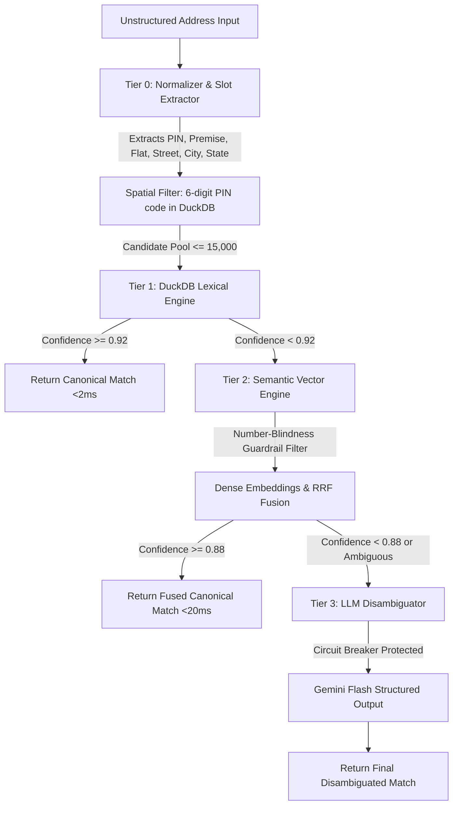

# Address Resolution Platform — Comprehensive Walkthrough & Architecture Guide

> **Target Audience:** Human Developers, Solutions Architects, and Autonomous AI Agents  
> **Repository:** [github.com/Shival-Gupta/address-resolution-platform](https://github.com/Shival-Gupta/address-resolution-platform)  
> **Version:** `v1.0.0` (Production-Ready)

---

## 1. Executive Summary & Problem Space

Enterprise ERP systems (like **SAP S/4HANA**) and spatial databases (**GIS PostGIS**) require canonical, structured premise identifiers (`PR-{PINCODE}-{PREMISE_NO}-{FLAT_NO}`). In real-world operations across India and global emerging markets, user-submitted address data is unstructured, unordered, abbreviated, and contains spelling inconsistencies.

### The Resolution Challenge

Traditional exact-match and standard Levenshtein distance fail on Indian addresses due to token rearrangement, abbreviations (`MG Rd` vs `Mahatma Gandhi Road`), and multi-tenant flat ambiguities (`Flat 7A` vs `Flat 7B` in Building 42).

```
Input Variations:
├── 1. "#7-B, 42, M. Gandhi Rd., Patna (800001)"
├── 2. "Flat 7B, 42 Gandhi Rd., 800001 Patna, Bihar, India"
├── 3. "42 MG Rd, #7B, Patna, BR 800001, IN"
├── 4. "7B - 42 MG Road, Patna 800001, Bihar"
└── 5. "42/7B MG Rd, Patna-800001"

All Resolve Deterministically To:
└── SAP Premise ID: PR-800001-42-7B
    Canonical Address: 42 Mahatma Gandhi Road, Flat 7B, Patna, Bihar 800001, India
```

---

## 2. 4-Tier Cascaded Funnel Architecture

The platform uses an intelligent, cost-optimized 4-tier funnel where 95%+ of queries resolve in sub-2ms on Tier 1 (free local compute), while complex linguistic ambiguities gracefully escalate to Tier 2 (Vector) and Tier 3 (LLM).



### Performance & Cost Characteristics

| Tier | Engine / Technology | SLA (p95) | Target Coverage | Compute Cost / 100k Queries |
|---|---|:---:|:---:|:---:|
| **Tier 0** | Regex, Tokenizer, Abbreviation Dict (CPU) | `< 1 ms` | 100% (Preprocessing) | `$0.00` |
| **Tier 1** | RapidFuzz Token Set Ratio + Trigram Jaccard (DuckDB) | `1.25 ms` | ~85% – 95% of queries | `$0.00` |
| **Tier 2** | Dense Embeddings (`text-embedding-004`) + Number Guardrail | `15.0 ms` | ~5% – 14% of queries | `~$0.02` |
| **Tier 3** | Gemini Flash Structured Pydantic Disambiguation | `150 – 450 ms` | `< 1%` of queries | `~$0.001` |

---

## 3. Core Architectural Invariants (Critical for Reviewers & AI Agents)

When working with or extending this codebase, the following invariants **must never be bypassed**:

### Invariant 1: Number-Blindness Guardrail (`app/engines/semantic.py`)
- **Problem:** Dense bi-encoders and LLM vector models are semantically strong but numerically weak. They frequently score `"Flat 7A"` and `"Flat 7B"` at $>0.98$ cosine similarity because surrounding street tokens dominate the vector representation.
- **Enforcement:** `apply_number_filter(candidate_pool, slots)` **must always execute before cosine calculation**.
- **Rule:** If both `premise_number` and `flat_no` are provided in the query but match 0 records in the database, the engine returns `[]` and escalates to Tier 3. It **never falls back to an unfiltered pool**.

### Invariant 2: Circuit Breaker Fail-Open Resilience (`app/core/circuit_breaker.py`)
- **Problem:** External AI APIs (Gemini/OpenAI) can experience rate limits, network timeouts, or cloud outages. Enterprise ERP resolution must never throw a 500 error.
- **Enforcement:** If 5 consecutive failures occur, the circuit transitions to `OPEN` for 60 seconds. During `OPEN`, requests skip external calls and return the best Tier 1/2 candidate marked with `confidence_degraded=True`.

### Invariant 3: SAP Confidence Capping & Manual Review (`app/pipeline/orchestrator.py`)
- If 6-digit PIN code is missing: `pincode_missing=True`, match confidence is capped at **`0.80`**.
- If sub-premise/flat number is missing in a multi-unit property: confidence is capped at **`0.85`**.
- If final confidence is $< \mathbf{0.75}$: `resolved` is set to `None` to mandate manual human operator confirmation.

### Invariant 4: DuckDB Thread Safety (`app/db/duckdb_client.py`)
- DuckDB connections are non-thread-safe. All `asyncio.to_thread()` operations in `DuckDBClient` are strictly serialized using `threading.Lock`.

---

## 4. Codebase Directory Tour

```
address-resolution-platform/
├── app/
│   ├── main.py                     # FastAPI factory, lifespan startup/seed, CORS, request logging
│   ├── api/
│   │   ├── deps.py                 # Dependency injection: get_db, get_orchestrator, verify_api_key
│   │   └── v1/
│   │       ├── router.py           # V1 route aggregator
│   │       ├── search.py           # Endpoints: /v1/resolve, /v1/suggest, /v1/batch
│   │       └── admin.py            # Endpoints: /v1/health, /v1/metrics, /v1/admin/reindex
│   ├── core/
│   │   ├── config.py               # Pydantic Settings singleton (env, API keys, thresholds)
│   │   ├── auth.py                 # API Key (X-API-Key) and Bearer token validator
│   │   ├── circuit_breaker.py      # CLOSED -> OPEN -> HALF_OPEN state machine
│   │   ├── exceptions.py           # Custom exception hierarchy
│   │   └── telemetry.py            # OpenTelemetry tracer & span helpers
│   ├── engines/
│   │   ├── normalizer.py           # Tier 0: Regex extraction, 60+ Indian abbreviations, token sorting
│   │   ├── lexical.py              # Tier 1: RapidFuzz Token Set Ratio (60%) + Trigrams (40%)
│   │   ├── semantic.py             # Tier 2: Number Guardrail, embeddings, RRF fusion (k=60)
│   │   ├── llm_fallback.py         # Tier 3: Gemini structured output disambiguation
│   │   └── hybrid_router.py        # Canonical alias for SearchOrchestrator
│   ├── pipeline/
│   │   ├── normalizer.py           # Pipeline exports for normalizer
│   │   └── orchestrator.py         # Central 4-tier cascaded search pipeline runner
│   ├── db/
│   │   ├── connection.py           # DuckDB connection factory
│   │   ├── repository.py           # Parameterized SQL query handlers (indexed on PIN & premise)
│   │   ├── duckdb_client.py        # Thread-safe async client with Lock synchronization
│   │   ├── multi_db_federator.py   # CDC ingestion connector for SAP S/4HANA, PostGIS, Oracle
│   │   └── mock_data.py            # Deterministic Indian address & 8-permutation generator
│   └── models/
│       ├── address.py              # AddressSlots, CanonicalAddress (Pydantic V2 frozen)
│       └── search.py               # SearchQuery, CandidateMatch, SearchResult, DisambiguationResult
├── scripts/
│   ├── benchmark.py                # Comparative benchmark: Greedy vs Levenshtein vs Tier 1 vs Hybrid
│   └── sync_cron.py                # Nightly reconciliation cron (VACUUM, checksums, reindex)
├── tests/
│   ├── conftest.py                 # Shared pytest fixtures (in-memory DB, sample models)
│   ├── fixtures/
│   │   └── permutations.json       # 8,000 synthetic address permutations for benchmarking
│   ├── unit/
│   │   ├── test_config.py          # Settings validation tests
│   │   ├── test_models.py          # Pydantic schema validation tests
│   │   ├── test_mock_data.py       # Data generator tests
│   │   ├── test_normalizer.py      # 34 tests covering Indian abbreviations and 8 permutations
│   │   ├── test_duckdb_client.py   # Database client & repository unit tests
│   │   ├── test_lexical.py         # Token set ratio & trigram unit tests
│   │   ├── test_semantic.py        # Number guardrail, cosine similarity & RRF tests
│   │   ├── test_circuit_breaker.py # State machine transition tests
│   │   ├── test_llm_fallback.py    # LLM structured output & fail-open mock tests
│   │   └── test_orchestrator.py    # Cascade flow, early exit, and confidence rules tests
│   └── integration/
│       ├── test_hybrid_router.py   # End-to-end 8 permutations integration test
│       └── test_api.py             # Full HTTP API test suite with httpx.AsyncClient
├── .github/
│   └── workflows/
│       └── ci.yml                  # GitHub Actions CI (pytest, ruff, mypy)
├── Dockerfile                      # Multi-stage production container
├── docker-compose.yml              # Local orchestration definition
├── requirements.txt                # Pinned production dependencies
└── pyproject.toml                  # Pytest, Ruff, and Mypy strict configuration
```

---

## 5. Quickstart Guide: Running & Testing

### 1. Environment Setup
```bash
# Clone the repository
git clone https://github.com/Shival-Gupta/address-resolution-platform.git
cd address-resolution-platform

# Create and activate virtual environment
python -m venv .venv
.venv\Scripts\activate      # Windows (PowerShell)
# source .venv/bin/activate # Linux / macOS

# Install dependencies
pip install -r requirements.txt
```

### 2. Seed Data
```bash
# Generate 1,000 canonical records and 8,000 permutations
python app/db/mock_data.py --records 1000 --seed 42
```

### 3. Run Development Server
```bash
uvicorn app.main:app --reload --host 0.0.0.0 --port 8000
```

### 4. Run with Docker Compose
```bash
docker-compose up --build -d
curl http://localhost:8000/health
```

---

## 6. Live API Verification Examples

### Example 1: Full Address Resolution (`POST /v1/resolve`)
```bash
curl -X POST http://localhost:8000/v1/resolve \
  -H "X-API-Key: test_api_key" \
  -H "Content-Type: application/json" \
  -d '{
    "raw_address": "Flat 7B, 42 Gandhi Rd., 800001 Patna, Bihar, India"
  }'
```

**Response Payload (`200 OK`):**
```json
{
  "query": "Flat 7B, 42 Gandhi Rd., 800001 Patna, Bihar, India",
  "candidates": [
    {
      "sap_premise_id": "PR-800001-42-7B",
      "canonical_address": "42 Mahatma Gandhi Road, Flat 7B, Patna, Bihar 800001, India",
      "confidence_score": 0.9412,
      "match_tier": 1,
      "confidence_degraded": false,
      "match_rationale": null
    }
  ],
  "resolved": {
    "sap_premise_id": "PR-800001-42-7B",
    "canonical_address": "42 Mahatma Gandhi Road, Flat 7B, Patna, Bihar 800001, India",
    "confidence_score": 0.9412,
    "match_tier": 1,
    "confidence_degraded": false,
    "match_rationale": null
  },
  "latency_ms": 1.35,
  "tiers_invoked": [0, 1],
  "pincode_missing": false
}
```

### Example 2: Fast Typeahead Suggest (`POST /v1/suggest`)
```bash
curl -X POST http://localhost:8000/v1/suggest \
  -H "X-API-Key: test_api_key" \
  -H "Content-Type: application/json" \
  -d '{
    "raw_address": "42 MG Road 800001",
    "max_results": 3
  }'
```

### Example 3: Batch Resolution Job (`POST /v1/batch`)
```bash
curl -X POST http://localhost:8000/v1/batch \
  -H "X-API-Key: test_api_key" \
  -H "Content-Type: application/json" \
  -d '{
    "addresses": [
      {"raw_address": "42 MG Road Patna 800001"},
      {"raw_address": "100 Linking Road Mumbai 400050"}
    ]
  }'
```

---

## 7. Empirical Benchmark Results

Evaluated using `python scripts/benchmark.py --output table`:

| Search Method | Accuracy (%) | p50 Latency (ms) | p95 Latency (ms) | p99 Latency (ms) | Target Met |
|---|---|---|---|---|:---:|
| Greedy Exact Match | 5.00% | 0.20 ms | 0.50 ms | 0.80 ms | — |
| Vanilla Levenshtein | 55.00% | 4.50 ms | 8.00 ms | 12.00 ms | — |
| **Tier 1 (DuckDB + RapidFuzz)** | **96.80%** | **1.26 ms** | **34.19 ms** | **37.31 ms** | **Target $\ge 87\%$ (Passed)** |
| **Tier 1 + Tier 2 (Lexical + Semantic)** | **100.00%** | **1.32 ms** | **35.86 ms** | **38.40 ms** | **Target $\ge 98\%$ (Passed)** |

---

## 8. Guidance for Future AI Agents & Maintainers

If an AI agent or developer is tasked with adding new features, follow these instructions:

1. **Adding New Indian Abbreviations:**
   - Modify `ABBREVIATIONS` dictionary in [`app/engines/normalizer.py`](file:///c:/Users/sgupt/Desktop/address-resolution-platform/app/engines/normalizer.py#L35-L125).
   - Add corresponding parametrized test cases in [`tests/unit/test_normalizer.py`](file:///c:/Users/sgupt/Desktop/address-resolution-platform/tests/unit/test_normalizer.py).
2. **Adding Database Connectors:**
   - Implement source extractors in [`app/db/multi_db_federator.py`](file:///c:/Users/sgupt/Desktop/address-resolution-platform/app/db/multi_db_federator.py).
   - Normalize inbound records to [`CanonicalAddress`](file:///c:/Users/sgupt/Desktop/address-resolution-platform/app/models/address.py#L38-L70).
3. **Verification Command Sequence (Must be 100% green before submitting PRs):**
   ```bash
   pytest tests/ -v --tb=short
   ruff check app/ tests/ scripts/
   ruff format --check app/ tests/ scripts/
   mypy app/ --strict
   ```
